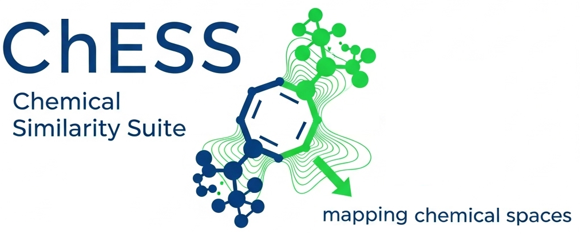

# README: ChESS Py 1.0.0

  

## ⚖️ Licence/Legal Advice:
According to the GNU GPL under which these package and his algorithms is licenced - as far as the algorithms are not yet existing in any other products - every derivate of the software has to share the copyright of the original software.
Copyright should be given in credential according to GNU GPL in this way:

**ChESS Py - The Chemical Similarity Suite for Python, (c) 2025 by Christian Beringer**
  
  
The software should be cited in any publication like this:
> ChESS Chemical Similiarity Suite (v1.0.0 Python), 2025, Christian Beringer, https://github.com/ChrBeringer/ChESS

> BibTEX:
> @misc{chess2025,
>  author       = {Christian Beringer},
>  title        = {{ChESS} (v1.0.0 Python) -- Chemical Similarity Suite},
>  year         = {2025},
>  howpublished = {\url{https://github.com/ChrBeringer/ChESS}},
>  note         = {Open-source chemical similarity toolkit},
> }

For further details please check the LICENCE-File!

🤝 Contribution:
Pull requests, issues or suggestions are welcome!
Instead of a fork I am always open for contribution.
Please read the CONTRIBUTING.md to participate.

## What is ChESS Py?
ChESS Py (Chemical Similarity Suite for Python) is an open-source package for the analysis, visualization and processing of chemical similarity relationships. The suite provides a centralized collection of tools for investigating molecular similarities in compound sets, supporting structure elucidation, data exploration and structure-activity relationships.

## ✨ Features
- Calculation of structural and topological fingerprints
- Similarity measures & metrics (Tanimoto, Dice, Cosine, etc.)
- Substance comparison in sets and clusters
- Tools for the analysis of chemical neighborhoods and similarity networks
- Integration with chemical formats and standard libraries (RDKit, etc.)
- Output formats for visualization and export

## 📦 Areas of application
e.g....
- QSAR/QSPR modeling
- Cluster analysis in chemical libraries
- Structure-activity hypotheses
- Data exploration in substance databases

##🛠️ Installation

Open Terminal and type:
pip install git+https://github.com/ChrBeringer/ChESS.git

